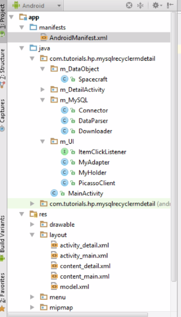
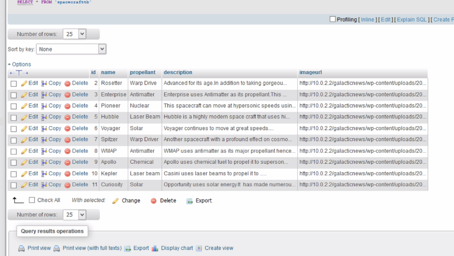
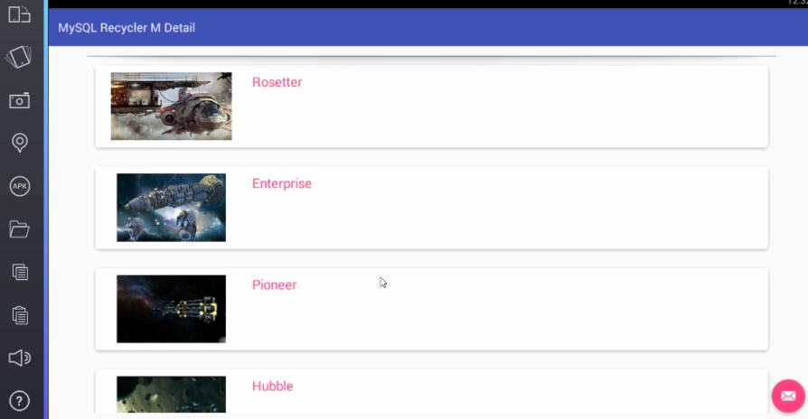
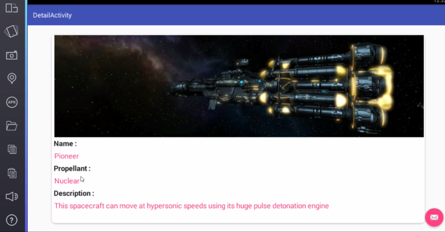

# MySQLRecyclerMDetail
RecyclerView Master Detail With MySQL database data

This is a simple android MySQL Master Detail tutorial.

* We have two activities : MainActivity,the master activity as well as DetailActivity.
* The master activity shall contain a RecyclerView with images and text in cardviews.
* When a viewitem is cliced we open detail activity and pass data.

* Our images we fetch from a local site.
* You have to create a database and table and fill it with data.You can use tools like PHPMyAdmin.

The Master Page :
* Contains a RecyclerView with our List of data.
* Each ViewItem is CardView with textview and imageview.

The Detail Page :
* The detail page.
* Displays each data objects properties in a new activity.
* The data is passed from the Master Activity via intents.

 	
